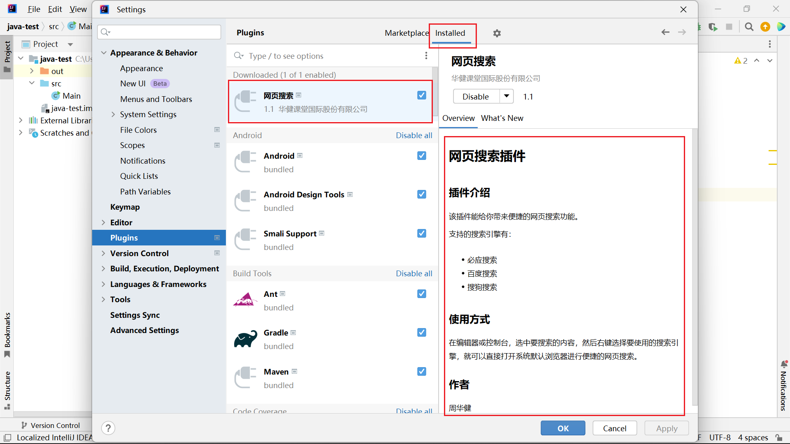
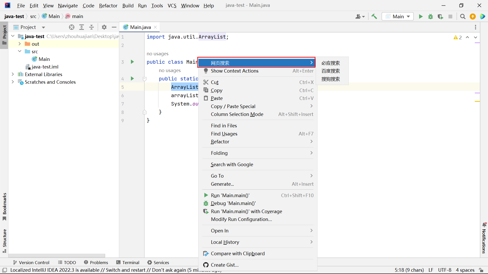
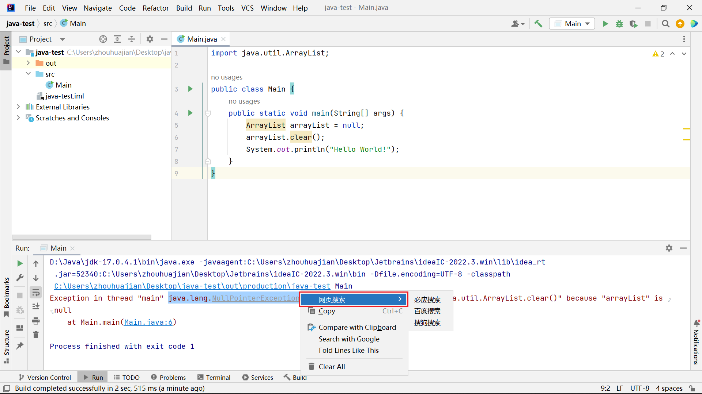
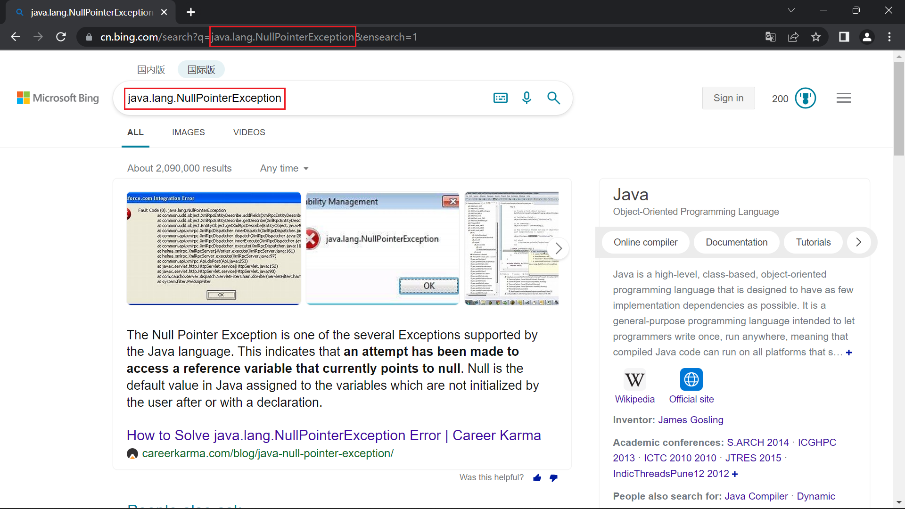

# Java IntelliJ Platform 网页搜索插件项目

## 课程介绍

IDEA、PyCharm、PHPStorm、AndroidStudio等耳熟能详的IDE，都是基于JetBrains公司的IntelliJ Platform开发的。

可以基于IntelliJ Platform开发定制的IDE或者开发IDE插件，只要遵循它的开源协议。

在使用IDE时，如果要进行网页搜索，可能要经历“复制-打开浏览器-访问搜索页面-粘贴-回车”这几个过程。

本课程将带同学们开发一个能进行快速搜索的网页搜索插件。在IDE编辑器或控制台，选中文本右键，选择具体搜索引擎就能进行快速的网页搜索。

## 项目截图

